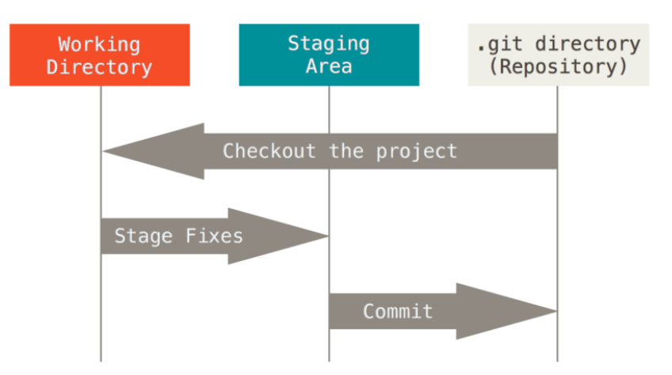
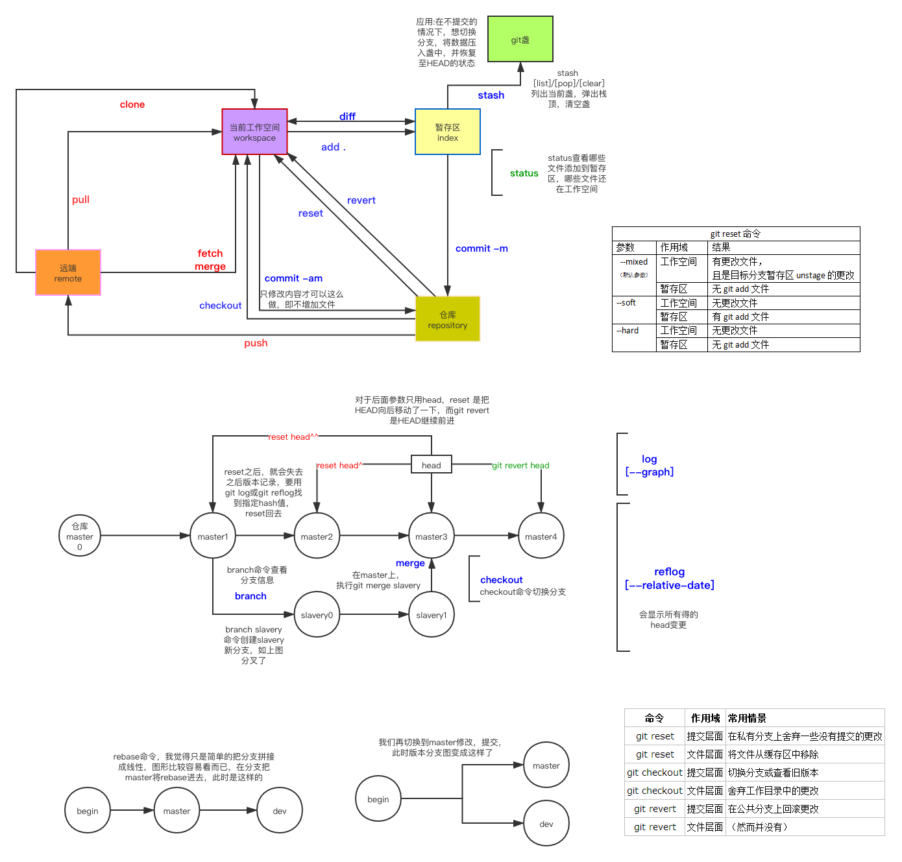

[toc]

本次讲解git进阶的仓库地址：https://github.com/iamphc/other-test-for-git
欢迎各位👨‍🦲下载，记的标星

***

### 深入了解git👨‍🦲（ppt）

#### 基本概念👨‍🦲
- 版本控制系统(version control system 简称 VCS),是一种记录一个或若干文件内容变化，以便将来查阅特定版本修订情况的系统。
- 你可以把它想象成一个文件时光机，有了它你就可以将某个文件回溯到之前的状态，甚至将整个项目都回退到过去某个时间点的状态；你可以比较文件的变化细节，查出是谁的修改在哪里引入了问题代码，即便你不小心错删了一些文件也能够通过它很方便的找回。

#### 设计理念👨‍🦲
- 文件存储
- 分布式

#### 发展历史👨‍🦲（ppt）
- 本地版本控制系统
- 集中化的版本控制系统
- 分布式的版本控制系统

#### 同类工具的比较👨‍🦲
[比较：GIT SVN CVS](https://medium.com/@deryacortuk17/version-control-software-comparison-git-mercurial-cvs-svn-21b2a71226e4)
||git|SVN|CVS|
|---|---|---|---|
|分布规则|分布式+集中式「1」|集中式|集中式| 
|数据存储单元|元数据|文件||
|并发修改||||
|并发提交|||❌|
|速度|快速高效|比较慢||
|跨平台||更好的windows支持||
|代码跟踪|||❌|

***
- 「1」：git也有集中式的概念，但是git更加倾向于使用分布式的模式
***

#### 工作原理👨‍🦲（ppt）

 
***

### 下面开始加速了👨‍🦲